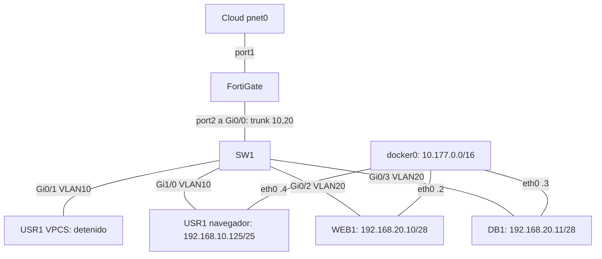

# Punto de continuación de la práctica

## Estado real actual (25 de septiembre de 2026)

La topología operativa actual usa el direccionamiento de la matrícula **20221745**:

- Usuarios, VLAN 10: `10.17.45.0/25`, gateway `10.17.45.1`.
- Servidores, VLAN 20: `10.17.45.128/28`, gateway `10.17.45.129`.
- WEB1: `10.17.45.130/28`, HTTPS activo.
- DB1: `10.17.45.131/28`, MySQL 8.0.23 activo en TCP/3306.
- Cliente gráfico de usuario: `10.17.45.20/25` para pruebas.
- VLAN 30 existe en el switch, pero no tiene puertos asignados ni se usa en el diseño actual.

Verificaciones completadas en este estado:

- Switch: Gi0/0 trunk con VLAN 10 y 20; Gi0/1 y Gi1/0 en VLAN 10; Gi0/2 y Gi0/3 en VLAN 20.
- WEB1 → DB1 TCP/3306: permitido; la cuenta `webapp` usa origen `10.17.45.130` y consulta `practica.productos`.
- WEB1 → DB1 TCP/22 y TCP/33060: bloqueados por el firewall local de DB1.
- Usuario → DB1 TCP/3306: bloqueado.
- Usuario → WEB1 HTTPS: HTTP 200.
- FortiGate: VLAN 10, VLAN 20, ruta por defecto, políticas, File Filter y DoS configurados por GUI.

Pendientes reales: demostrar y registrar el bloqueo SQL Injection con DPI/IPS y cuarentena; demostrar el bloqueo de descargas `.exe`; demostrar rate limiting; persistir el firewall local y `skip-name-resolve` de DB1; activar seguridad básica del switch; guardar running-configs y completar README, imágenes, diagrama y video.

Última revisión directa: 25 de septiembre de 2026. Host PNETLab: **192.168.22.132**.

## Actualización de direccionamiento individual

El usuario confirmó que su matrícula es **20221745** y que la regla compartida por sus compañeros usa los últimos cuatro dígitos como `10.<primeros dos>.<últimos dos>.0/24`. El diseño oficial pendiente de aplicar queda:

| Segmento | VLAN | Red | Gateway | Hosts previstos |
|---|---:|---|---|---|
| Usuarios | 10 | `10.17.45.0/25` | `10.17.45.1` | DHCP `.20`–`.120` |
| Servidores | 20 | `10.17.45.128/28` | `10.17.45.129` | WEB `.130`, DB `.131` |

El usuario confirmó que WEB1 y DB1 deben permanecer en la misma red de servidores /28. Por ello, la separación VLAN30 que se aplicó temporalmente debe revertirse. FortiGate no puede inspeccionar el tráfico lateral entre dos hosts de la misma VLAN; la restricción WEB1→DB1 únicamente por TCP/3306 tendrá que verificarse también con firewall local en DB1, mientras se conservan las políticas GUI exigidas por la asignación. La tabla anterior reemplaza el direccionamiento provisional `192.168.x.x` y la subred temporal VLAN30, pero todavía no se ha aplicado.

## Preferencia vigente: el usuario realiza los cambios

El usuario pidió participar ejecutando los comandos para aprender. Desde este punto, el asistente explica y verifica mediante consultas de solo lectura; no aplica nuevas configuraciones ni instalaciones en los equipos por su cuenta. Dar pasos breves y explicar su propósito antes de que el usuario los ejecute.

Antes de esa indicación se creó `practica`, la tabla `productos` con dos filas y `webapp` limitado a origen 192.168.20.10 con SELECT/INSERT/UPDATE/DELETE sobre practica.*. Credencial aleatoria privada en el host `/root/pnet-practica-secrets/webapp.json` y WEB1 `/root/.my-practica.cnf`; no publicar. Se agregó a WEB1 ruta por defecto vía 192.168.20.1. La instalación del cliente MySQL en WEB1 se inició y está pendiente de comprobar su resultado. Próxima actividad para el usuario: conectar desde WEB1 usando `mysql --defaults-extra-file=/root/.my-practica.cnf`, comprobar `SELECT USER(), CURRENT_USER(), DATABASE();` y consultar `productos`.

## Actualización: traslado a VLAN30 realizado y probado

Esta actualización sustituye las direcciones y estados anteriores descritos en el inventario histórico inferior.

- El usuario creó VLAN30-DB por GUI y modificó DB_SERVER a `192.168.30.11/32`, asociación any. Políticas 2, 3 y 4 verificadas con salida VLAN30-DB; políticas 3 y 4 conservan entrada VLAN20-SERVERS, MySQL permitido antes de ALL denegado. Sin NAT entre servidores.
- Se agregó VLAN30 al trunk SW Gi0/0 y se cambió **Gi0/3 a access VLAN30**. Se ejecutó `write memory` con resultado OK: el trunk y el traslado están guardados en el switch.
- DB1 eth1 ahora es **192.168.30.11/28**, con una sola ruta por defecto vía **192.168.30.1**. WEB1 conserva 192.168.20.10/28.
- Se agregaron rutas a 192.168.30.0/28 en WEB1 vía 192.168.20.1 y en USR1 navegador vía 192.168.10.1.
- En el namespace de red de DB1, regla INPUT `-i eth0 ! -s 10.177.0.1/32 -j DROP`. Bloquea entrada por Docker desde otros contenedores, conservando administración desde el host PNETLab. No se cambió el firewall del host.
- Pruebas después del cambio: WEB→DB TCP/3306 abierto; WEB→DB TCP/22 y TCP/33060 timeout; USR1→DB TCP/3306 timeout; WEB y USR1→10.177.0.3 TCP/3306 timeout; administración PNETLab→DB TCP/23 abierta. HTTPS desde USR1 responde **200** (curl -k; confianza del certificado no verificada). DB1 alcanza su gateway y MySQL sigue activo.
- Estos resultados verifican los puertos probados; la regla ALL denegada cubre los otros servicios, pero no se probó cada puerto ni se corroboraron todavía los eventos en la GUI de FortiGate.
- **Persistencia pendiente:** la red y la regla INPUT de los contenedores se aplicaron en ejecución. No se verificó reinicio/recreación; antes de hacerlo, preservar/aplicar esos ajustes y resolver el arranque de MySQL/AppArmor. El script `scripts/auditoria/migrar-db1.sh` conserva los comandos exactos aplicados.
- Próximo bloque: persistencia y respaldo de contenedores, base de datos y usuario para WEB1, luego perfiles de seguridad y evidencias GUI.
- Evidencias locales: `evidencias/pre-migracion.txt`, `evidencias/migracion-db1.txt`, `evidencias/verificacion-vlan30.txt`.

### Verificación actual posterior

- Se comprobó directamente por SSH que no quedan procesos `apt`/`dpkg` activos en PNETLab; el cliente `/usr/bin/mysql` está instalado en WEB1 y el archivo privado `/root/.my-practica.cnf` existe allí.
- DB1 sigue activo en `192.168.30.11/28`, escucha en TCP/3306 y TCP/33060, y contiene `practica.productos`.
- `SHOW GRANTS` confirma que `webapp@192.168.20.10` solo tiene USAGE global y SELECT/INSERT/UPDATE/DELETE sobre `practica.*`.
- La conexión WEB1→DB1 por TCP/3306 está abierta; WEB1→DB1:22 y usuario→DB1:3306 están bloqueados.
- La primera consulta desde WEB1 con timeout de 5 s falló durante el handshake porque MySQL intentó resolver DNS inverso. Con timeout de 30 s funcionó: `USER()=webapp@192.168.20.10`, `CURRENT_USER()=webapp@192.168.20.10`, `DATABASE()=practica`, y devolvió las dos filas de `productos`. Para una demostración más limpia, queda pendiente reducir la demora de DNS mediante `/etc/hosts` o `skip-name-resolve`, ejecutado por el usuario y probado sin exponer la contraseña.

## Inventario histórico anterior al traslado

Este documento describe el estado observado, no una práctica terminada. Tiene prioridad sobre las suposiciones del diseño inicial de `LAB-PLAN.md`. La primera revisión fue de solo lectura; los cambios posteriores están detallados en la actualización superior. No contiene contraseñas.

## Propósito y condiciones

Demostrar segmentación y protección de un servidor HTTPS y un servidor de base de datos con FortiGate. Usuarios en VLAN 10 y /25; servidores con /28. Toda configuración y demostración de FortiGate debe hacerse por GUI. Las consultas CLI de esta revisión son únicamente diagnóstico y no sustituyen las evidencias GUI exigidas.

La entrega requiere repositorio GitHub, video al principio del README, documentación con imágenes y diagramas, scripts y running-configs. La existencia de un repositorio o video externo no ha sido comprobada.

## Cableado confirmado

Se contrastaron el archivo `/opt/unetlab/labs/Practica Seguridad De Redes.unl`, las interfaces de los procesos QEMU y los bridges del host.

| Conexión | Uso actual |
|---|---|
| Cloud/Net `pnet0` ↔ FortiGate `port1` | WAN y administración |
| FortiGate `port2` ↔ SW1 `Gi0/0` | Trunk 802.1Q, VLAN 10 y 20 |
| SW1 `Gi0/1` ↔ USR1 VPCS `eth0` | VLAN 10; VPCS existe en topología, no se observó ejecutándose |
| SW1 `Gi0/2` ↔ WEB1 `eth1` | VLAN 20 |
| SW1 `Gi0/3` ↔ DB1 `eth1` | VLAN 20 |
| SW1 `Gi1/0` ↔ USR1 navegador `eth1` | VLAN 10 |
| WEB1, DB1 y USR1 navegador `eth0` ↔ `docker0` | Red adicional 10.177.0.0/16 |

## Estado de los equipos

### Switch

- VLAN 10 `USERS`: Gi0/1 y Gi1/0.
- VLAN 20 `SERVERS`: Gi0/2 y Gi0/3.
- **VLAN 30 `DATABASE` ya existe**, sin puertos asignados. No está permitida en el trunk.
- Gi0/0 tiene `switchport trunk encapsulation dot1q` y `switchport mode trunk` en running-config. Estas dos líneas no aparecen en startup-config: hay cambios sin guardar.
- Gi1/1, Gi1/2 y Gi1/3 están sin enlace, en VLAN 1 y no administrativamente apagados.
- No se observaron port-security, DHCP snooping ni PortFast/BPDU Guard configurados en los puertos. La seguridad básica del switch sigue pendiente.
- La consola se encontró en `Switch(config-if)#`. Se usó `do show ...` sin salir de ese modo ni aplicar cambios.

### WEB1

- Contenedor `docker3`, imagen en ejecución `pnetlab/apache2:latest`.
- eth1: `192.168.20.10/28`; eth0: `10.177.0.2/16`.
- Ruta hacia usuarios: `192.168.10.0/25 via 192.168.20.1 dev eth1`. No se observó ruta por defecto.
- Apache escucha en TCP/80 y TCP/443. HTTPS local responde 200 con el contenido `Web Server is running`.
- La prueba usó `curl -k`: confirma servicio HTTPS, no confianza del certificado.
- `/var/www/html` contiene solamente `index.html`. No se observó una aplicación conectada a la base de datos ni PHP cargado en Apache.
- También escucha SSH/22 y Telnet/23.

### DB1

- Contenedor `docker4`, imagen **en ejecución** `pnetlab/mysql_server:latest`.
- El archivo del laboratorio indica **otra imagen**, `pnetlab/ubuntu_sv:latest`. Resolver la discrepancia antes de recrear el nodo; no asumir que la configuración actual se recuperará automáticamente.
- eth1: `192.168.20.11/28`; eth0: `10.177.0.3/16`.
- Dos rutas por defecto: vía `192.168.20.1` por eth1 y vía `10.177.0.1` por eth0.
- MySQL **8.0.23**, activo. No se instaló MariaDB.
- Escucha en `0.0.0.0:3306` y `0.0.0.0:33060`, además de SSH/22 y Telnet/23.
- Solo existen bases de sistema. No hay base ni usuario de aplicación para WEB1. Root usa `auth_socket` y está limitado a localhost.
- Para resolver temporalmente el error de `libpthread.so.0`, se retiró del host el perfil AppArmor `/usr/sbin/mysqld`. La revisión confirma que no está cargado. Falta una solución permanente; el host también ejecuta su propio MySQL.
- Los tres contenedores revisados son privilegiados, están `unconfined` y no tienen volúmenes montados. No recrearlos como método de reparación sin preservar antes su contenido.

### Usuario

- Hay **dos nodos llamados USR1**: uno VPCS y uno con navegador. El navegador está activo (`docker6`, `pnetlab/pnet-chrome:latest`).
- Navegador eth1: `192.168.10.125/25`; eth0: `10.177.0.4/16`.
- Ruta a servidores: `192.168.20.0/28 via 192.168.10.1 dev eth1`. No se observó ruta por defecto.
- No se comprobó que la dirección actual proviniera de DHCP. En este contenedor no está instalado el comando `ip`; se inspeccionó su namespace de red con `nsenter` desde PNETLab.

### FortiGate: verificado directamente por consola

Revalidado el 25 de septiembre de 2026 después de que el usuario abrió la sesión. Se consultaron estado, interfaces, rutas, DHCP, objetos, políticas, DoS y VIP sin modificar la configuración.

- FortiOS 7.0.9 build0444, modo NAT. Licencia de evaluación válida; vencimiento reportado: 9 de octubre de 2026. Bases IPS/APP de 2015 y antivirus de 2018; comprobar capacidades y actualizaciones disponibles antes de prometer demostraciones de firmas.
- port1 por DHCP. Ruta por defecto activa `0.0.0.0/0 via 192.168.22.2, port1`. La IP WAN exacta aún no se extrajo.
- `VLAN10-USERS`: `192.168.10.1/25`, VLAN ID 10 sobre port2.
- `VLAN20-SERVERS`: `192.168.20.1/28`, VLAN ID 20 sobre port2.
- VLAN30-DB creada por el usuario desde la GUI y verificada directamente: `192.168.30.1/28`, ID 30 sobre port2, acceso PING, sin DHCP. La ruta conectada `192.168.30.0/28` ya aparece en FortiGate.
- DHCP en VLAN10: rango `192.168.10.20` a `192.168.10.120`, máscara /25, gateway `192.168.10.1`, DNS `8.8.8.8`. La IP actual .125 del navegador está fuera de ese rango; todavía no se demostró obtención por DHCP.
- `DB_SERVER` está asociado a VLAN20-SERVERS y apunta a `192.168.20.11/32`. Al migrar deben actualizarse tanto el objeto como las interfaces de destino de las políticas 2, 3 y 4.

| ID | Política existente | Entrada → salida | Servicio |
|---|---|---|---|
| 1 | USERS_TO_WEB_HTTPS | VLAN10 → VLAN20 | HTTPS, aceptar y registrar |
| 2 | USERS_TO_DB_BLOCK_MYSQL | VLAN10 → VLAN20 | MYSQL, denegar y registrar |
| 3 | WEB_TO_DB_MYSQL | VLAN20 → VLAN20 | MYSQL, aceptar y registrar |
| 4 | WEB_TO_DB_BLOCK_OTHER | VLAN20 → VLAN20 | ALL, denegar y registrar |
| 5 | SERVERS_TO_INTERNET_TEMP | VLAN20 → port1 | DNS/HTTP/HTTPS, aceptar, NAT y registro |

Los perfiles DPI/SSL, IPS/cuarentena y control de aplicaciones no están aplicados en las políticas consultadas. Las tablas `firewall DoS-policy` y `firewall vip` están vacías. Falta verificar perfiles disponibles y completar seguridad, publicación HTTPS si se exige acceso desde WAN y pruebas. No marcarlos como completados por la mera existencia de las cinco políticas.

## Pruebas realizadas

Conexiones TCP individuales, sin payloads maliciosos ni pruebas de carga. Se fijó la dirección origen para distinguir la red del laboratorio de la red Docker.

| Origen | Destino | Resultado observado |
|---|---|---|
| WEB1 192.168.20.10 | DB1 192.168.20.11:3306 | TCP abierto |
| WEB1 192.168.20.10 | DB1 192.168.20.11:22 | TCP abierto: no cumple «solo 3306» |
| WEB1 10.177.0.2 | DB1 10.177.0.3:3306 | TCP abierto por red Docker |
| USR1 192.168.10.125 | WEB1 192.168.20.10:443 | TCP abierto |
| USR1 192.168.10.125 | DB1 192.168.20.11:3306 | Timeout, compatible con bloqueo; falta corroborar logs de FortiGate |
| USR1 10.177.0.4 | DB1 10.177.0.3:3306 | TCP abierto: camino alternativo que evita FortiGate |
| WEB1 local | https://127.0.0.1/ | HTTP 200 sobre TLS, sin validar confianza del certificado |

Una petición HTTPS inicial desde el navegador agotó el timeout de 3 segundos; después se comprobó apertura TCP/443. Todavía no se considera validada la navegación HTTPS completa desde USR1.

## Próximos pasos acordados

1. Revisión básica de FortiGate, interfaz VLAN30-DB, objeto DB_SERVER y políticas 2, 3 y 4: completados y verificados.
2. Traslado DB1 a 192.168.30.11/28, Gi0/3 access VLAN30 y trunk actualizado: completados. Switch guardado.
3. Bloqueo de acceso a DB1 por eth0/docker0 aplicado y probado; falta persistencia en contenedores.
4. Preservar configuraciones y datos, corregir persistencia y resolver AppArmor antes de reiniciar/recrear nodos.
5. Crear base y usuario restringido de aplicación, terminar servicios/perfiles requeridos y validar cada criterio con evidencias GUI, logs y pruebas.
6. Preparar la entrega en GitHub con video, imágenes, diagramas, scripts y configuraciones revisadas para no publicar secretos.

## Regla de continuidad

No repetir la instalación de MariaDB ni rehacer las cinco políticas. No confundir Gi0/0 (trunk a FortiGate) con Gi0/3 (DB1). VLAN30 ya está aplicada en FortiGate, trunk y DB1. Consultar primero la actualización superior; el inventario y pruebas iniciales se conservan como historial.

## Limitación documentada de IPS/SQL Injection

Se creó el sensor `IPS_SQLI_LAB` y se asociaron firmas de SQL Injection a la política temporal de prueba HTTP. Se enviaron payloads desde USR1 hacia WEB1. El tráfico llegó al servidor, pero FortiGate respondió `0 logs found` para la categoría IPS. Por tanto, la detección no se presenta como demostrada; la evidencia queda en `evidencias/ips-sqli-resultado.txt`.
