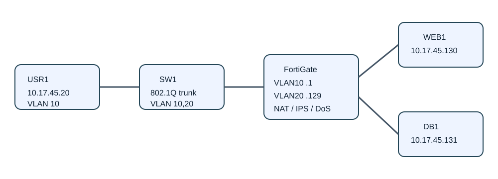
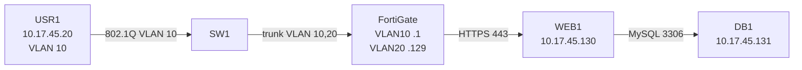

# Práctica de Seguridad de Redes — Matrícula 20221745

## Video demostrativo

[Ver video demostrativo](https://youtu.be/Wf0GChKHD4U)

## Propósito

Implementar una red segmentada y aplicar controles de seguridad con FortiGate, un switch Cisco, un servidor web HTTPS, un servidor de base de datos y una red de usuarios.

## Direccionamiento

| Segmento | Red | Gateway | Equipos |
|---|---|---|---|
| VLAN 10 Usuarios | `10.17.45.0/25` | `10.17.45.1` | USR1 `10.17.45.20` |
| VLAN 20 Servidores | `10.17.45.128/28` | `10.17.45.129` | WEB1 `.130`, DB1 `.131` |

## Controles implementados

- Ruta por defecto y NAT en FortiGate.
- HTTPS de usuarios hacia WEB1.
- Bloqueo de usuarios hacia DB1 en TCP/3306.
- WEB1 autorizado hacia DB1 únicamente en TCP/3306.
- Firewall local de DB1 bloqueando SSH y MySQL X Protocol desde WEB1.
- Filtro de archivos `.exe` aplicado al tráfico web.
- Política de anomalías TCP SYN para limitar intentos de DoS.
- Port-security, DHCP snooping, PortFast y BPDU Guard en el switch.
- IPS configurado con sensor `IPS_SQLI_LAB`.

## Diagrama

## Evidencias

- [Seguridad del switch](evidencias/seguridad-switch-resultado.txt)
- [Running-config del switch](evidencias/running-config-switch.txt)
- [Filtro de descargas EXE](evidencias/filtro-exe-resultado.txt)
- [Resultado de IPS/SQL Injection](evidencias/ips-sqli-resultado.txt)
- [Estado general](ESTADO-PRACTICA.md)

## Limitación IPS

El sensor y las firmas IPS fueron configurados, pero FortiGate no generó eventos para los payloads probados (`0 logs found`). Esta limitación se reporta explícitamente en lugar de presentar la detección como validada.

## Scripts

Los scripts utilizados para preparación, pruebas y auditoría se encuentran en [`scripts/auditoria/`](scripts/auditoria/).
